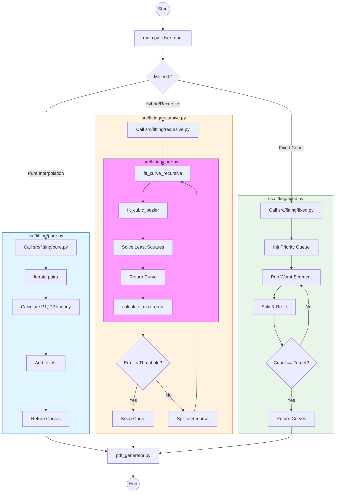

# System Architecture & Flow Visualization

## 1. Module Structure (`src/fitting/`)

The curve fitting logic is modularized into the `src/fitting/` package to separate mathematical primitives from high-level strategies.

### A. `src/fitting/core.py` (Math Primitives)
Contains purely mathematical functions with no strategy logic.
*   **`chord_length_parameterize(points)`**: Assigns parameter values ($t$) to points based on chord length.
*   **`fit_cubic_bezier(points)`**: Solves the Least Squares system to fit a single cubic Bezier curve to a set of points.
*   **`calculate_max_error(points, curve)`**: Computes the maximum Euclidean distance between points and their corresponding curve positions.

### B. `src/fitting/pure.py` (Pure Interpolation Strategy)
*   **`fit_curve_pure_interpolation(points)`**: Connects every consecutive pair of points with a Bezier curve that behaves like a straight line. Used for high-fidelity but inefficient representation (1:1 compression).

### C. `src/fitting/recursive.py` (Hybrid/Recursive Strategy)
*   **`fit_curve_recursive(points, threshold)`**: A "Divide and Conquer" approach. Fits a curve, checks error; if error > threshold, splits the points at the max error index and recurses. Balances accuracy and curve count.

### D. `src/fitting/fixed.py` (Fixed Count Optimization)
*   **`fit_curves_to_fixed_count(contours, count)`**: Uses a Priority Queue (Heap) to iteratively split the curve segment with the highest error until a specific target curve count is reached.

---

## 2. Execution Flow Diagram

This diagram visualizes the data flow from user input in `main.py` through the selected strategy module.

